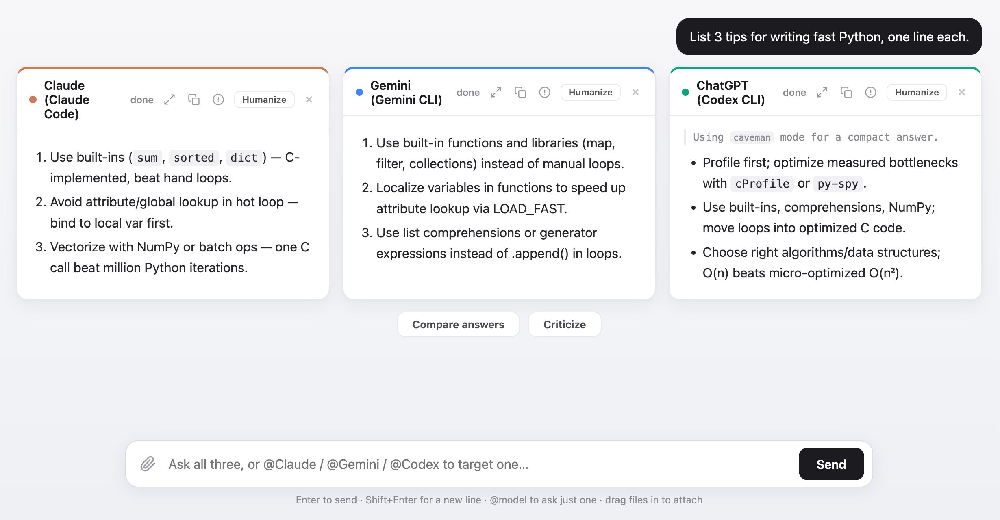

# Prism

One prompt refracted into three answers, side by side. A single web page fans your prompt out to
**Claude**, **Gemini**, and **ChatGPT** by shelling out to each vendor's official CLI,
so it runs on your existing **subscriptions** instead of per-token API billing.

> **Built on CLIs, not APIs.** Prism does not call any model API and stores no API
> keys. It spawns the official command-line tools (`claude`, `agy`, `codex`),
> which authenticate with your existing subscription logins (Claude Pro/Max,
> Google account, ChatGPT). That means zero per-token cost, but also: the three
> CLIs must be installed and logged in on the machine running Prism, and the
> responders are coding *agents* that can use tools (web search, file reading),
> not bare chat endpoints.



```
Browser (3 panes + 1 prompt)
   |  POST /ask  -> streamed NDJSON back
Node/Express
   |- spawn  claude -p ... --output-format stream-json   -> pane 1 (live tokens)
   |- spawn  agy --print ... --model "Gemini …"          -> pane 2 (Antigravity)
   |- spawn  codex exec --json ...                       -> pane 3
```

## Features

**Asking**
- One prompt fans out to all three models; answers stream side by side.
- `@Claude` / `@Gemini` / `@Codex` (or `@ChatGPT`) targets only those models; no
  mention uses your default models (Settings).
- Drag & drop (or paperclip) attaches text, code, images, and PDFs.
- Markdown and LaTeX (MathJax) rendering; Enter sends, Shift+Enter newlines.

**Two modes (chosen per chat)**
- **+ New chat** -> *Standard*: the classic three side-by-side panes, full
  answers, one row per prompt. `✓` on an answer makes the next prompt build on it.
- **+ New tree chat** -> *Tree of thoughts*: a branching node graph (below).
- A chat keeps the mode it was created in; a single chat is never both.

**Tree of thoughts** (tree-mode chats)
- The chat is drawn as a **node graph**: a dark prompt node is connected by lines
  to its answer cards, and a selected answer is connected to the follow-up it
  spawned. The edges show which answer each branch grew from. Node positions are
  laid out automatically; children sit under their parent.
- Each answer is a compact **card** (tinted) with a one-sentence summary the model
  writes itself.
- **Click an answer** to open it (full text, white) and select it; click again to
  close it. With an answer selected, the next prompt makes **all models build on
  that one answer**, converging into three new cards under it.
- **Click a prompt** node to select it (and open its answers); the next prompt then
  has **each model continue its own answer** in that group, giving three parallel
  parent-to-child lines.
- With **nothing selected**, a new prompt continues from the **last answers** the
  same way (three parallel lines, each model from its own).
- Other answers are kept. Select any answer or prompt later and ask again to
  explore a different branch, so the conversation grows into a tree.
- A node or prompt that **already has follow-ups** can't be branched again; delete
  its descendants first (× on the follow-up prompt) to ask a different question there.
- **⤢** on a card opens/closes it without selecting; **Expand all** / **Collapse
  all** open or close every card. New answers open automatically while they
  stream. The layout re-flows around the larger nodes.

**Comparing the models** (Compare answers / Criticize)
- **Compare**: a semantic synthesis of a prompt's answers (consensus, differences,
  unique points). **Criticize**: every model critiques the others; the `!` icon
  critiques a single answer.
- Both open in a popup. In **Standard** mode, closing the popup also shows the
  result inline (synthesis below the answers, critiques under each card); **Tree**
  mode keeps it popup-only.
- Syntheses and critiques are saved with the chat.

**Per-card tools** (expanded card header)
- Copy the answer as markdown; criticize just this answer.
- **Humanize**: rewrite an answer to remove the AI tone (Korean text); a
  Settings toggle applies it to every response automatically.

**Chats**
- Auto-saved history in the sidebar: rename (double-click), delete, deep-link
  via `?conv=<id>`.
- **Temporary chat** mode: nothing is saved.
- Deleting a prompt (`×` on hover) removes it, its answers, and the whole
  subtree branched from them.

**Settings & Skills**
- Default models, base model per service (`opus`/`sonnet`/`haiku` or custom),
  font family/size, and **night mode** (dark theme).
- Personalization: standing instructions (like custom instructions / CLAUDE.md)
  sent to every model with every prompt.
- Enable/disable each CLI's skills from the Skills panel: Claude and Codex skills,
  plus the Gemini pane's Antigravity (`agy`) plugins.
- Update banner when the GitHub repo is ahead of your running version; the
  server auto-restarts when a CLI binary updates.

## Prerequisites

The three CLIs must be installed and **logged in** (each uses its own subscription auth):

| Pane    | CLI        | Install                              | Log in            |
|---------|------------|--------------------------------------|-------------------|
| Claude  | `claude`   | Claude Code                          | already signed in |
| Gemini  | `agy`      | Antigravity (antigravity.google)     | via Antigravity   |
| ChatGPT | `codex`    | `brew install codex` / npm           | `codex login`     |

Check: `claude --version`, `agy --version`, `codex --version` should all print.

> Note: Google ended the free Gemini CLI tier for individuals, so the Gemini
> pane now runs through **Antigravity** (`agy`), which serves Gemini models. Pick
> the exact model in Settings → base model (default: Gemini 3.1 Pro High).

## Run

```bash
npm install
node server.js        # http://localhost:3000
```

Type a prompt, press **Enter** (Shift+Enter for a newline). Each box streams its model's
answer. Past chats are saved automatically and listed in the left sidebar.

## Run at startup (macOS)

A launchd LaunchAgent starts the server at login and restarts it if it crashes, so
`http://localhost:3000` is always available. The agent sets `PATH`/`HOME` explicitly
because launchd's default environment is too minimal to find the three CLIs.

```bash
# install / reload
launchctl load -w ~/Library/LaunchAgents/com.dongwookim.aggregationai.plist
# status (pid, last exit code)
launchctl list | grep aggregationai
# stop + remove from startup
launchctl unload -w ~/Library/LaunchAgents/com.dongwookim.aggregationai.plist
# logs
tail -f server.log server.err.log
```

After editing `server.js`, restart it with:
`launchctl kickstart -k gui/$(id -u)/com.dongwookim.aggregationai`

## How it works

- `server.js` spawns the three CLIs in parallel, each with its working directory set to
  a throwaway scratch dir (`$TMPDIR/aggai-scratch`) so the agentic CLIs never touch real
  projects. Each model's `parse()` pulls plain text out of one stdout line:
  - **Claude**: `stream-json` deltas (`stream_event -> content_block_delta -> text_delta`)
  - **Codex**: `--json` events (`item.completed` where `item.type === "agent_message"`)
  - **Gemini**: `agy --print` (Antigravity) plain stdout, forwarded as-is
- The browser streams the response as newline-delimited JSON and appends each chunk to
  its pane.

## Notes

- These are coding **agents**, not chat endpoints. For a plain question they just answer,
  but they can use tools. Codex runs `--sandbox read-only`; Claude/Gemini run in the
  scratch dir.
- To add or reorder models, edit the `MODELS` map in `server.js`. The UI builds its panes
  from `/models`.
